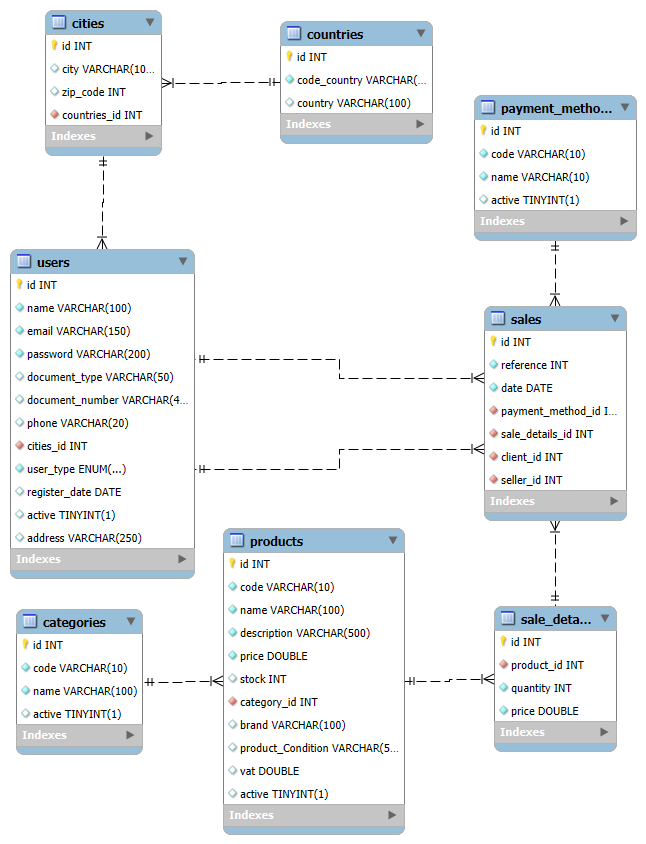

# 🛒 E-commerce SQL Database

Este proyecto contiene el diseño y creación de una base de datos para un sistema de comercio electrónico. Incluye el modelo entidad-relación (ER), scripts para la creación de tablas y carga de datos de prueba.

## 📸 Diagrama Entidad-Relación

A continuación, se muestra el diagrama ER del sistema, generado con MySQL Workbench:



> 💡 Si no puedes ver la imagen, el srchivo `Diagrama.png` se encuentra en la raiz del repositorio para su visualizacion.

## 📂 Estructura del Repositorio

- `Diagrama E-commerce.mwb`: Archivo de MySQL Workbench que contiene el diseño visual del modelo ER.
- `create_tables.sql`: Script SQL para crear todas las tablas del esquema de base de datos.
- `data_set.sql`: Script SQL para insertar datos de ejemplo y poblar las tablas.

## 📌 Requisitos

- MySQL Server (versión 8.0 o superior recomendada)
- MySQL Workbench (para visualizar el archivo `.mwb`)
- Cliente SQL o gestor de base de datos para ejecutar los scripts

## 🚀 Cómo usar

1. Clona este repositorio:

   ```bash
   git clone https://github.com/juangomezn/E-commerce-SQL.git
   cd E-commerce-SQL
   ```

2. Abre el archivo `Diagrama E-commerce.mwb` con **MySQL Workbench** para visualizar o editar el modelo.

3. Ejecuta el script `create_tables.sql` en tu servidor MySQL para crear la base de datos y sus tablas.

4. Ejecuta el script `data_set.sql` para insertar datos de ejemplo en las tablas.

## 📘 Descripción del Modelo

El modelo incluye las siguientes entidades principales:

- `Users`: Clientes registrados en el sistema
- `Products`: Productos disponibles para la venta
- `Orders`: Pedidos realizados por los clientes
- `OrderDetails`: Detalle de los productos en cada pedido
- `Categories`: Clasificación de los productos
- `Payments`: Información de pagos asociados a pedidos

Este modelo permite gestionar usuarios, productos, pedidos y pagos de manera eficiente para un sistema de e-commerce básico.

## 📜 Licencia [](https://opensource.org/licenses/Apache-2.0) 

<div style="
    background: linear-gradient(90deg, #e8e8e8 100%);
    border-left: 4px solid #3498db;
    padding: 1rem;
    border-radius: 4px;
    margin: 1rem 0;
    box-shadow: 0 2px 5px rgba(0,0,0,0.1);
">

Este proyecto está licenciado bajo **Apache License 2.0**.  
Para más información, consulta el archivo [LICENSE](LICENSE) o visita [apache.org/licenses](https://www.apache.org/licenses/LICENSE-2.0).
</div>

<h2>
  ✨ Elaborado por
  
</h2>

[](https://github.com/juangomezn)

[](www.linkedin.com/in/juangomezn)

[](mailto:gomezninoj681@gmail.com)
